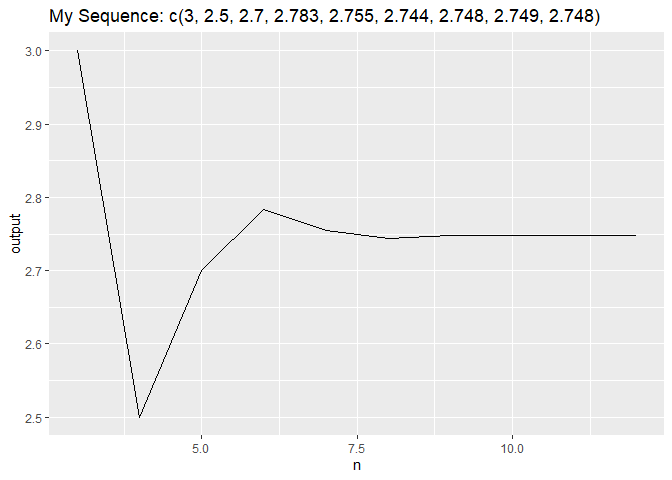

<!-- README.md is generated from README.Rmd. Please edit that file -->

# hw04pcshoffmann

<!-- badges: start -->
<!-- badges: end -->

The goal of hw04pcshoffmann is to provide Christopher Hoffmann’s
implementation of hw04 for STAT-413 (Data Science). It includes two
functions: `cshSequence()` and `cshPlot()` which utilizes the previous
function.

## Installation

You can install the released version of hw04pcshoffmann from GitHub:

``` r
install_github("STAT-413-613-21S/hw04pcshoffmann")
```

## Package Functions

### cshSequence

The function `cshSequence()` utilizes a recursive function to find the
value of the nth element in a sequence. The parameters are a numeric
vector of *exactly* three elements (x) and an integer (n) denoting the
final element of the sequence.

``` r
library(hw04pcshoffmann)

cshSequence(c(2, 4, 3), 7)
#> [1] 2.754762
```

### cshPlot

The function `cshPlot()` will return a line plot of all the elements in
a sequence and its respective value in that sequence. It takes a data
frame (df) consisting of four columns. The first three columns should
represent the first three numbers of a sequence, and the final column
indicates the last element of the sequence.

``` r
my_data <- tibble::tribble(
  ~x, ~y, ~z, ~n,
  2,4,3,3,
  2,4,3,4,
  2,4,3,5,
  2,4,3,6,
  2,4,3,7,
  2,4,3,8,
  2,4,3,9,
  2,4,3,10,
  2,4,3,12)

cshPlot(my_data)
```


